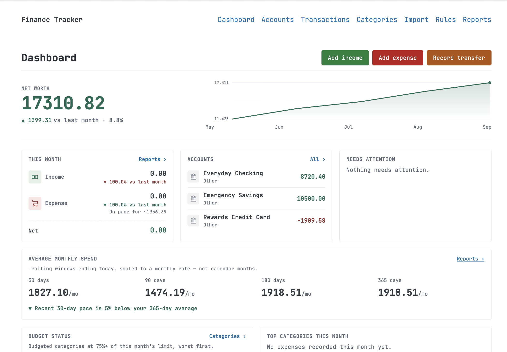
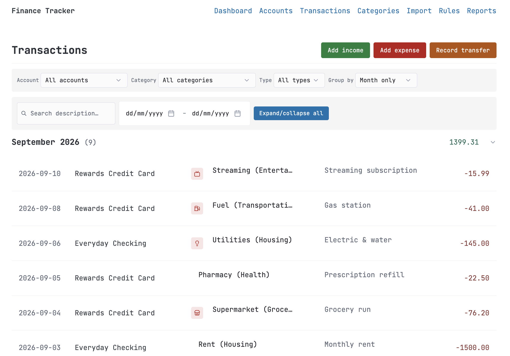
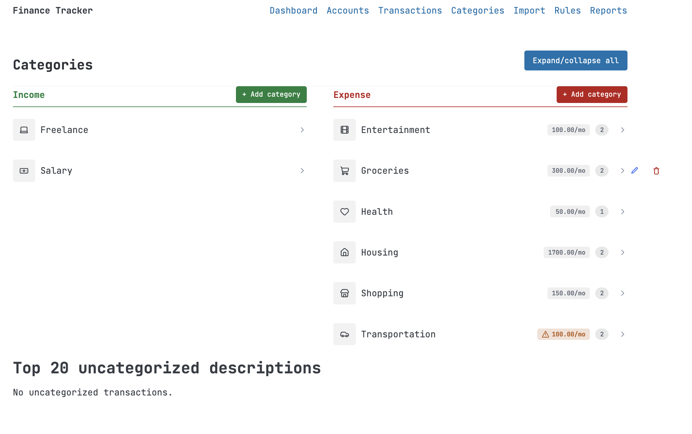
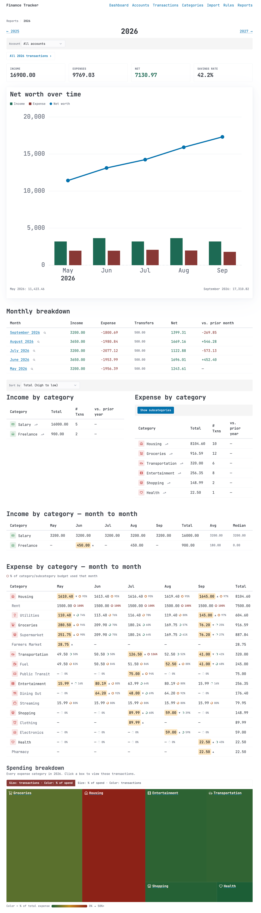

# Finance App

A local, single-user personal finance tracker. Your data stays on your machine in plain files — no
account, no cloud, no bank integrations, and no network access beyond `localhost`.

## Features

- **Accounts** — checking, savings, credit card, cash, investment; active/closed status; running balances.
- **Transactions** — add income, expenses, and transfers between your own accounts; edit, delete,
  search, and filter by account, category, type, and date range; group by month and type.
- **Categories** — separate income and expense trees with subcategories, icons, and optional
  monthly budgets.
- **Bank CSV import** — one-time column-mapping wizard per bank (handles odd delimiters,
  encodings, and date/decimal formats), reused automatically afterwards. Previews new vs.
  duplicate rows before writing anything.
- **Rules** — regex rules (with optional amount and income/expense bounds) auto-categorize imports
  and can be re-run over your existing ledger with a full before/after preview.
- **Transfer detection** — finds imported rows that are really transfers between your accounts.
- **Dashboard & reports** — net worth, monthly/yearly income and expense, category drill-downs,
  budget utilization, month-end spending forecast, and suggested budgets.

## Screenshots

All screenshots use made-up sample data.

### Dashboard



An at-a-glance summary: net worth with a 6-month trend, this month's income and expense versus
last month (plus a month-end spending forecast), active account balances, trailing average
monthly spend, and budget status. The green/red/amber buttons add income, an expense, or a
transfer without leaving the page.

### Transactions



Every transaction, grouped by month with per-month totals and counts. Filter by account,
category, type, description text, or date range, and change how rows are grouped. Category icons
are color-coded by type, and the category and note on each row can be edited in place.

### Categories



Separate income and expense category trees with icons, optional monthly budgets, and
subcategories (the number badge). An amber warning marks a category whose subcategory budgets add
up to more than its own. Below the trees, a table lists your most frequent uncategorized
descriptions, which are good candidates for a new auto-categorization rule.

### Yearly report



The per-year drill-down: income, expenses, net, and savings rate; a net-worth chart with monthly
income/expense bars; a monthly breakdown; income and expense by category with year-over-year
change; month-by-month category matrices with budget-utilization rings; and a spending treemap.
Category names link through to the matching transactions.

## Requirements

- Python 3.11+
- [`uv`](https://docs.astral.sh/uv/)

## Getting started

```bash
uv sync                          # install dependencies
uv run python scripts/launch.py  # start the server and open your browser
```

The app runs at <http://127.0.0.1:8000>. Press Ctrl+C in the terminal to stop it.

For development with auto-reload:

```bash
uv run uvicorn app.main:app --reload
```

## Your data

| Path | Contents |
| --- | --- |
| `data/ledger.csv` | Every transaction, one row each |
| `data/import_history.toml` | Log of past CSV imports |
| `config/accounts.toml` | Accounts |
| `config/categories.toml` | Categories, subcategories, icons, budgets |
| `config/rules.toml` | Auto-categorization rules |
| `config/import_mappings/` | Saved per-bank CSV column mappings |

Files are created on first use. **Back these up yourself** (e.g. copy `data/` and `config/`) —
the app keeps no backups. Don't edit them by hand while the app is running.

## Importing a bank export

1. Go to **Import**, pick the destination account, and upload the CSV.
2. The first time for a given bank, map the date, description, and amount columns (plus optional
   extras like account number or counterparty account).
3. Review the preview (new / duplicate / filtered-out), then confirm.

Later imports from the same bank reuse the saved mapping. Manage mappings and see import history
under **Import → Mappings**.

## Development

```bash
uv run pytest                    # run tests
uv run ruff check .              # lint
uv run ruff format .             # format
```

Layout: `app/storage/` (file I/O), `app/services/` (pure business logic), `app/routers/` (HTTP),
`app/templates/` (Jinja2 + HTMX). See `docs/implementation-plan.md` for the design and
`CLAUDE.md` for contributor/agent conventions.

> `scripts/seed_sample_data.py` resets `data/` and `config/` to fake sample data. **It overwrites
> your real data** — never run it against a live setup.
