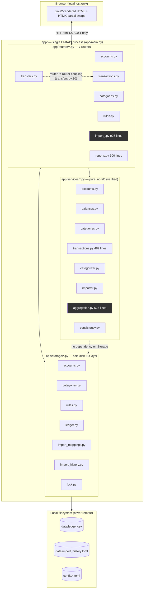

# Architecture Analysis — finance_app

Scope: `app/`, `tests/`, `docs/`, `pyproject.toml`. Excludes `data/`/`config/` contents
(gitignored user financial data — irrelevant to code architecture).

Method: every claim below was verified by reading the cited file/lines or by `grep`
across the tree; import-direction claims were verified with `grep -rn` against every
`app/services`, `app/storage`, and `app/routers` file. Nothing here is inferred from
CLAUDE.md's prose alone without checking the code it describes.

---

## 1. Evaluation

### 1.1 Separation of concerns — clear, and actually enforced

The codebase uses a strict three-layer split, and the layering is a **real, enforced
property**, not just a documented aspiration:

- `app/routers/*.py` — FastAPI path operations + HTML/HTMX response assembly.
- `app/services/*.py` — pure business logic, `list[Transaction]` in/out, no I/O.
- `app/storage/*.py` — the only layer that touches `data/`/`config/` on disk.

Verified:
- `grep -rn "from app.routers\|import app.routers" app/services app/storage app/models`
  → **zero matches**. Nothing below the router layer imports a router (no inversion).
- `grep -rn "from app.storage\|import app.storage" app/services` → **zero matches**.
  Every `services/*.py` module's own "pure, no file I/O" docstring claim holds up.
- `grep -rn "\.open(\|read_text\|write_text\|tomllib\|tomli_w" app/services app/routers app/models`
  → the only hit is a **prose mention** of `tomli_w` inside a docstring
  (`app/models/rule.py:44`), not a call. No router or service module does file I/O
  directly; every read/write goes through `app/storage/*.py`.
- Service-to-service imports form a clean DAG, not a tangle:
  `app/services/transactions.py:18` imports `normalize_account_number` from
  `app/services/importer.py:31`, which imports `categorize` from
  `app/services/categorizer.py`. One direction, no cycle.

**One real gap**: business-rule *validation* for `Rule` CRUD lives in the router, not a
service — see §3 and finding F1. Every other domain (`accounts`, `categories`,
transactions/transfers) has its validation in `app/services/<domain>.py`; rules do not
— there is no `app/services/rules.py` at all (confirmed: `ls app/services/` lists
`accounts.py, aggregation.py, balances.py, categories.py, categorizer.py, consistency.py,
importer.py, transactions.py` — no `rules.py`).

### 1.2 Architectural pattern

**Three-tier layered architecture** (router/presentation → service/domain → storage/
persistence), server-rendered with FastAPI + Jinja2 + HTMX, over flat-file storage
(CSV + TOML, no database). This is confirmed by the import-direction greps above, not
just CLAUDE.md's description.

It is **not MVC** — there is no controller layer distinct from the routers, and the
"model" layer (`app/models/*.py`, pydantic `BaseModel`s and `TypedDict`s) is pure data
shape, not active-record; persistence and validation both live elsewhere. It is **not
microservices** — one process, one FastAPI app (`app/main.py:54`), no service
boundaries, no network calls between components (`pyproject.toml`'s dependency list
has no HTTP client, DB driver, or queue library — see §2's "external integrations").

### 1.3 God objects/modules

By line count (`wc -l`):

| File | Lines | Role |
|---|---:|---|
| `app/routers/import_.py` | 926 | CSV import wizard (create/edit/run flows) + transfer detection |
| `app/services/aggregation.py` | 625 | reporting/grouping aggregation layer |
| `app/routers/reports.py` | 600 | reports pages incl. inline-SVG chart geometry |
| `app/services/transactions.py` | 482 | transaction/transfer business rules + transfer matching |
| `app/routers/categories.py` | 461 | category/subcategory CRUD |
| `app/routers/rules.py` | 445 | rule CRUD + bulk reclassification |
| `app/routers/transactions.py` | 435 | transaction CRUD + list/filter/group |

**`app/routers/import_.py` (926 lines, ~19 route handlers)** is the closest thing to a
god module in this codebase. It owns: file upload handling, column-picker preview
rendering (`_render_mapping_setup`, line 221), settings validation, mapping
persistence, CSV parsing glue, duplicate-detection glue, categorization glue, a
second parallel "edit mapping" flow (`_render_edit_form`/`_mapping_from_edit_form`,
lines 672–748) that largely re-implements the setup flow's column-selection logic
against plain `<input type=number>` fields instead of populated `<select>`s, **and**
the newer "detect transfers" preview/apply dialog (lines 848–926) — a feature that is
conceptually about `services.transactions.find_transfer_matches`, not about CSV
parsing, and arguably belongs on a transfers/reports-adjacent router instead. It is
cohesive in the sense that everything in it is triggered from the `/import` UI, but at
926 lines it is the largest single file in the app by a wide margin (next largest is
36% smaller) and mixes three sub-concerns (wizard, edit, detect-transfers) that could
be three modules.

**`app/services/aggregation.py` (625 lines, 19 top-level defs)** is large but
*cohesive* — every function operates on the same input shape (`list[Transaction]`) to
produce a grouping/total view for reports. This is a deliberate design choice
documented in CLAUDE.md ("one shared aggregation layer... not one-off per-view
logic") and the code honors it — no per-view duplicate aggregation logic exists
outside this file. Judged **not** a god object, but see finding F2 (real duplication
*within* this file between its year-scoped and month-scoped category-breakdown
functions).

No class in the codebase exceeds a handful of fields (everything is either a pydantic
`BaseModel`, a `@dataclass`, or a `TypedDict`) — there are no "god classes" in the
OOP sense; the risk here is entirely at the module/file level.

### 1.4 Dependency flow

Clean. Confirmed by grep (see §1.1): no circular imports, no layer inversion. The one
non-hierarchical coupling is **router-to-router**: `app/routers/transfers.py:10`
imports `render_table` from `app/routers/transactions.py` (renamed
`render_transactions_table`) to refresh the transactions list from the transfer
dialog. This is same-layer coupling (not a layering violation) and is explicitly
justified in both files' docstrings — `app/routers/transactions.py:57-75`'s
`render_table` docstring says it's "Public (no leading underscore) because it's reused
across routers." It is still a real coupling point: `transfers.py` cannot be
understood or tested in isolation from `transactions.py`. Every router also imports
the tiny shared `app/routers/htmx_events.py:toast` — this is a leaf utility module, not
a layering concern.

### 1.5 Modularity rating: **7/10**

Justification:
- **+** Layering is real and mechanically verified clean (routers/services/storage
  never inverted; services genuinely have zero I/O).
- **+** Storage modules are uniform (every one of the 7 `storage/*.py` files follows
  the identical read/write/lock/atomic-rename shape — verified by reading all of
  them).
- **+** No circular imports anywhere in the dependency graph.
- **−** One 926-line router (`import_.py`) doing three loosely-related jobs.
- **−** A real domain (rules) is missing its service-layer module, breaking the
  otherwise-consistent "router validates nothing, service validates everything"
  rule (F1).
- **−** Concrete copy-paste duplication inside `services/aggregation.py` between
  year-scoped and month-scoped category totals (F2), and inside
  `app/routers/transactions.py` between `render_table` and `list_transactions`'
  filter blocks (F3).
- Not lower than 7 because none of the above is structural rot — every issue found
  is a localized, fixable duplication or a single misplaced module, not systemic
  coupling or a tangled dependency graph.

---

## 2. Architecture diagram



### 2.1 Representative data flow — "Detect transfers" (import_.py:848–926)

```
GET /import/detect-transfers/preview
  routers/import_.py:preview_transfer_matches
    -> storage.accounts.read_accounts()      [disk read]
    -> storage.ledger.read_ledger()          [disk read, FULL FILE, every call]
    -> services.transactions.find_transfer_matches(all_txns, all_accounts)
         [pure, O(n) scan + per-anchor O(m) partner scan — see bottleneck below]
    -> renders import/_detect_transfers_preview.html
    -> candidate matches serialized to a hidden JSON form field
       (no server-side session state — the browser round-trips the preview
       payload back to the app on Apply)

POST /import/detect-transfers/apply
  routers/import_.py:apply_transfer_matches_route
    -> json.loads(matches_payload)           [trusts the round-tripped client data]
    -> services.transactions.apply_transfer_matches(...)  [pure]
    -> storage.ledger.write_ledger(...)      [disk write, FULL FILE REWRITE, locked]
```

This flow is representative of every write path in the app: **read full file → pure
transform in memory → write full file back**, guarded by `storage.lock.file_lock`
(PID-based, `app/storage/lock.py:50-77`). There is no incremental/streaming I/O
anywhere.

### 2.2 External service integrations

**None.** Verified two ways:
- `pyproject.toml` dependencies: `fastapi`, `jinja2`, `pydantic`, `python-multipart`,
  `tomli-w`, `uvicorn` (runtime); `httpx`, `pytest`, `ruff` (dev-only — `httpx` here is
  the test client, not an outbound HTTP caller). No DB driver, no HTTP client library
  used at runtime, no queue/cache client.
- `grep -rn "requests\.\|httpx\.\|urllib.request\|socket\.\|boto3\|redis\|psycopg\|sqlalchemy\|pymongo" app/`
  → zero matches.
- `app/config.py:22` binds to `127.0.0.1` only (`SERVER_HOST = "127.0.0.1"`), and
  `app/main.py` mounts only local static files and local Jinja2 templates.

This matches CLAUDE.md's stated invariant ("no network access beyond `localhost`")
and is not merely documented — it is structurally true of the dependency graph.

### 2.3 Potential bottlenecks

All of these are **accepted, documented tradeoffs** at the app's stated scale
(~7,000–9,000 ledger rows, single user — CLAUDE.md's "Scale assumptions" section),
not bugs, but worth naming precisely since the question asked for them:

1. **Full-ledger read/write per request.** Every router handler that touches
   transactions calls `storage.ledger.read_ledger()` (`app/storage/ledger.py:64-71`,
   loads and parses the entire CSV) and, on write,
   `storage.ledger.write_ledger()` (`app/storage/ledger.py:79-91`, rewrites the
   *entire* file even for a single-row change). No pagination, no incremental
   append, no index. Explicitly accepted in CLAUDE.md ("Loading the full CSV into
   memory per request is an accepted, deliberate simplification").
2. **`services.transactions.find_transfer_matches`** (`app/services/transactions.py:336-421`)
   is O(n) to build `by_account`, then for each of up to n "anchor" transactions
   scans its entire counterparty account's transaction list looking for the closest
   date match (`app/services/transactions.py:365-379`) — worst case O(n·m) where m is
   the size of the largest single account's transaction list. At the documented
   ~9,000-row scale with a handful of accounts this is milliseconds, not a real
   bottleneck today, but it is the least sub-linear function in the codebase.
3. **`services.balances.account_balance`** (`app/services/balances.py:10-16`) is O(n)
   per account; `all_balances` (`app/services/balances.py:19-24`) calls it once per
   account, giving O(accounts × transactions) instead of one O(transactions) pass
   that buckets by `account_id`. Rendered on every `/accounts` page view.
4. **PID-based file locking with polling** (`app/storage/lock.py:50-77`) — a writer
   busy-waits in 50ms increments (`poll_interval=0.05`) up to a 5s timeout. Fine for
   a single local user; would not scale to concurrent writers, which the app
   explicitly never expects to have (CLAUDE.md: "single-user", "no manual editing
   while the app is running").

No pagination exists anywhere in the UI (confirmed by reading `transactions.py`,
`reports.py` — every list renders in full), consistent with the flat-file, single-user
design.

---

## 3. Anti-patterns

| Anti-pattern | Verdict |
|---|---|
| Spaghetti code | **None found.** Control flow in every router/service function read is linear and locally reasoned about; no long-range hidden state, no global mutation outside the file-lock/disk boundary. |
| Copy-paste programming | **Found**, two concrete instances — see F2, F3 below. |
| God classes/modules | **Borderline, one instance.** `app/routers/import_.py` at 926 lines mixing 3 sub-flows (see §1.3). No god *classes* exist — the codebase has essentially no classes with behavior, only data-shape models. |
| Tight coupling | **One instance, documented.** `transfers.py` ↔ `transactions.py` router coupling (§1.4). Not found elsewhere — services and storage modules are each independently testable (confirmed by `tests/unit/` having one test file per service/storage module, no cross-module test fixtures required). |
| Missing abstractions | **Found**, one instance — see F1 (no `services/rules.py`). |

**On the wizard's repeated column-picker logic** (the task specifically asked me to
judge this): `app/routers/import_.py` has near-identical
`account_number`/`description_fallback`/`counterparty_account`/
`counterparty_account_fallback` handling repeated across `_render_mapping_setup`
(line 221), `reparse_mapping_setup` (line 355), `save_mapping_setup` (line 402),
`_mapping_from_edit_form` (line 713), `save_edited_mapping` (line 751), and
`dry_run_mapping` (line 790). This **is** documented as deliberate in the module's own
code — a shared helper already exists (`_set_counterparty_columns`,
`app/routers/import_.py:97-111`) specifically to collapse the "add this optional
column key if set" logic into one place, and `_to_column_index` (line 92) does the
same for parsing. What remains repeated is the *parameter threading* (each of the ~5
form fields gets named individually as a `Form(...)` parameter in every route
function), not the validation/business logic itself. **Verdict: this is a
deliberate, partially-mitigated tradeoff, not an unmitigated anti-pattern** — FastAPI's
`Form(...)` dependency style has no clean way to group repeated optional fields
without a Pydantic form model (which the codebase doesn't use anywhere for forms), so
the repetition is a framework-shaped cost, not sloppiness. It does still contribute to
`import_.py`'s size (§1.3) and would be the first thing to shrink if that file is ever
split.

---

## 4. Findings table

| # | Finding | Category | Severity (1-10) | Location | Remediation |
|---|---|---|---:|---|---|
| F1 | No `services/rules.py` — rule CRUD validation (`_validate_rule`, `_parse_priority`, `_parse_amount_bound`, `_parse_rule_type`) lives in the router, unlike every other domain | Missing abstraction / inconsistent layering | 6 | `app/routers/rules.py:97-189` | See snippet below |
| F2 | Near-duplicate year-scoped vs. month-scoped category-total functions | Copy-paste programming | 5 | `app/services/aggregation.py:348-483` | See snippet below |
| F3 | `render_table` and `list_transactions` duplicate the same 3-line filter block | Copy-paste programming | 4 | `app/routers/transactions.py:80-86` vs. `160-166` | See snippet below |
| F4 | `app/routers/import_.py` is a 926-line router mixing wizard/edit/detect-transfers concerns | God module (borderline) | 5 | `app/routers/import_.py` (whole file) | See note below |
| F5 | `services.balances.all_balances` is O(accounts × transactions) instead of O(transactions) | Efficiency | 3 | `app/services/balances.py:10-24` | See snippet below |
| F6 | `router-router` coupling: `transfers.py` imports `transactions.py`'s `render_table` | Tight coupling (documented, low risk) | 2 | `app/routers/transfers.py:10` | Document only — see note below |
| F7 | Dead code: `storage.import_mappings.list_banks` is defined and unit-tested but never called from any router or service | Unused code | 2 | `app/storage/import_mappings.py:85-90` | Delete, or wire it into a bank-picker UI if intended for future use |
| F8 | `services.transactions.find_transfer_matches` is O(n·m) worst case, no index by counterparty account | Efficiency (not yet a real bottleneck at documented scale) | 2 | `app/services/transactions.py:336-421` | Note only — revisit if ledger size assumptions change |

---

## 5. Remediation snippets

### F1 (severity 6) — extract rule validation into `services/rules.py`

Create `app/services/rules.py` and move the four pure-validation helpers out of the
router, mirroring `app/services/categories.py`'s existing shape:

```python
# app/services/rules.py (new file)
"""Business rules for creating/editing auto-categorization rules.

Pure functions over rule form fields — no file I/O, matching every other
services module. Mirrors app/services/categories.py's validation shape.
"""
from decimal import Decimal, InvalidOperation
from app.models.transaction import TransactionType

def parse_priority(raw: str) -> int:
    raw = raw.strip()
    try:
        return int(raw) if raw else 0
    except ValueError as exc:
        raise ValueError("priority must be a whole number") from exc

def parse_amount_bound(raw: str, field_name: str) -> Decimal | None:
    raw = raw.strip()
    if not raw:
        return None
    try:
        value = Decimal(raw)
    except InvalidOperation as exc:
        raise ValueError(f"invalid {field_name}") from exc
    if value < 0:
        raise ValueError(f"{field_name} cannot be negative")
    return value

# ... parse_rule_type / validate_rule, moved verbatim from routers/rules.py
```

Then in `app/routers/rules.py`, replace the local `_parse_priority` /
`_parse_amount_bound` / `_parse_rule_type` / `_validate_rule` definitions
(`app/routers/rules.py:97-189`) with:

```python
from app.services.rules import validate_rule  # replaces _validate_rule
```

This is a pure move (no behavior change) — `compile_pattern` already lives in
`services.categorizer` and is already imported by the router (`app/routers/rules.py:26`),
so this closes the one remaining inconsistency between rules and every other domain.
Add `tests/unit/test_service_rules.py` alongside it (every other service module has a
matching unit test file; rules currently does not).

### F2 (severity 5) — collapse year/month category-total duplication

`_category_totals_for_year` and `_category_totals_for_month`
(`app/services/aggregation.py:348-360` and `:416-436`) differ only in their date
predicate. Replace both with one private helper taking an explicit predicate:

```python
def _category_totals(
    transactions: Iterable[Transaction],
    txn_type: TransactionType,
    matches_period: Callable[[date_], bool],
) -> dict[str, dict[str, _CategoryAccumulator]]:
    """Return {category: {subcategory: accumulator}} for txn_type rows where
    matches_period(transaction.date) is True."""
    totals: dict[str, dict[str, _CategoryAccumulator]] = defaultdict(
        lambda: defaultdict(_CategoryAccumulator)
    )
    for transaction in transactions:
        if transaction.type is not txn_type or not matches_period(transaction.date):
            continue
        bucket = totals[transaction.category][transaction.subcategory]
        bucket.total += abs(transaction.amount)
        bucket.count += 1
    return totals
```

Call sites become:
```python
current = _category_totals(transactions, txn_type, lambda d: d.year == year)
...
totals = _category_totals(
    transactions, txn_type, lambda d: d.year == year and d.month == month
)
```

The larger duplication between `category_breakdown` (`:364-410`) and
`category_totals_for_month` (`:439-483`) — building `CategoryTotal`/`SubcategoryTotal`
from a totals dict — is a good candidate for a second shared helper
(`_build_category_totals(totals, yoy_deltas=None)`), but that's a slightly larger
refactor than a drop-in snippet; flagging it here for a follow-up rather than forcing
it into this change.

### F3 (severity 4) — share the filter block between `render_table` and `list_transactions`

`app/routers/transactions.py:80-86` and `:160-166` are the same three `if`-filters on
`ledger`. Extract:

```python
def _filter_ledger(
    ledger: list[Transaction], *, account_id: str, category: str, subcategory: str
) -> list[Transaction]:
    if account_id:
        ledger = [t for t in ledger if t.account_id == account_id]
    if category:
        ledger = [t for t in ledger if t.category == category]
    if subcategory:
        ledger = [t for t in ledger if t.subcategory == subcategory]
    return ledger
```

Both call sites become one line:
```python
ledger = _filter_ledger(
    read_ledger(), account_id=account_id, category=category, subcategory=subcategory
)
```

### F4 (severity 5) — no snippet; structural split, sketch only

Splitting `app/routers/import_.py` cleanly is a multi-file refactor, not a drop-in
diff. Sketch: extract the "detect transfers" section (`app/routers/import_.py:848-926`,
already delimited by its own `# ----` comment banner) into a new
`app/routers/transfers.py` addition or a new `app/routers/transfer_detection.py`
mounted separately in `app/main.py`; it has no dependency on the wizard's upload/
column-picker state (it only calls `services.transactions.find_transfer_matches`/
`apply_transfer_matches`), so the extraction is mechanical. The wizard-vs-edit-flow
split (lines 221-926 minus detect-transfers) is more entangled (`_render_preview` at
line 496 is shared by both create and run flows) and would need more careful
design before touching — not attempted here per the "no invented fixes" constraint.

### F5 (severity 3) — single-pass account balances

```python
# app/services/balances.py
def all_balances(
    accounts: Iterable[Account], transactions: Iterable[Transaction]
) -> dict[str, Decimal]:
    balances = {account.id: account.starting_balance for account in accounts}
    for transaction in transactions:
        if transaction.account_id in balances:
            balances[transaction.account_id] += transaction.amount
    return balances
```
One pass over `transactions` instead of one pass per account. Verified via
`grep -rn "account_balance(" app tests`: `account_balance`
(`app/services/balances.py:10-16`) has no production caller other than
`all_balances` itself (only `tests/unit/test_balances.py:44,54` call it directly) —
it can be kept as a small tested public helper for a single account, or inlined into
the single-pass version above and re-exposed only if a future caller needs one
account's balance in isolation.

### F6 (severity 2) — no code fix, document only

The `transfers.py` → `transactions.py` router coupling is a reasonable, already-
documented tradeoff (`app/routers/transactions.py:57-75`'s docstring explains it
explicitly), not a defect. No remediation needed beyond what's already there.

### F7 (severity 2) — delete or wire up dead code

```diff
- def list_banks(dir_path: Path | None = None) -> list[str]:
-     """Return the display name of every bank with a saved mapping.
-
-     Sorted for a stable order in the import UI's bank picker.
-     """
-     return [mapping.bank for mapping in list_all_mappings(dir_path)]
```
Or, if a bank picker was intended (the docstring implies one was planned), wire it
into `app/routers/import_.py`'s create flow (`new_mapping_page`,
`app/routers/import_.py:157-164`) as a datalist of existing banks. **Unable to verify**
which was intended — would need to check `docs/implementation-plan.md`'s Phase 3
notes for whether a bank-picker UI was ever planned and dropped, or whether this was
added speculatively and never used.

### F8 (severity 2) — no code fix now

Not a real bottleneck at the documented ~9,000-row/single-user scale. If that scale
assumption ever changes, the fix would be indexing `find_transfer_matches`'s
`by_account` dict by `(account_id, amount)` instead of just `account_id`, turning the
inner scan (`app/services/transactions.py:365-379`) from O(m) to O(1) average case.
Not implemented here since CLAUDE.md explicitly rejects adding indexing for the
current documented scale ("don't add indexing, pagination, or a caching layer to
'fix' this").
